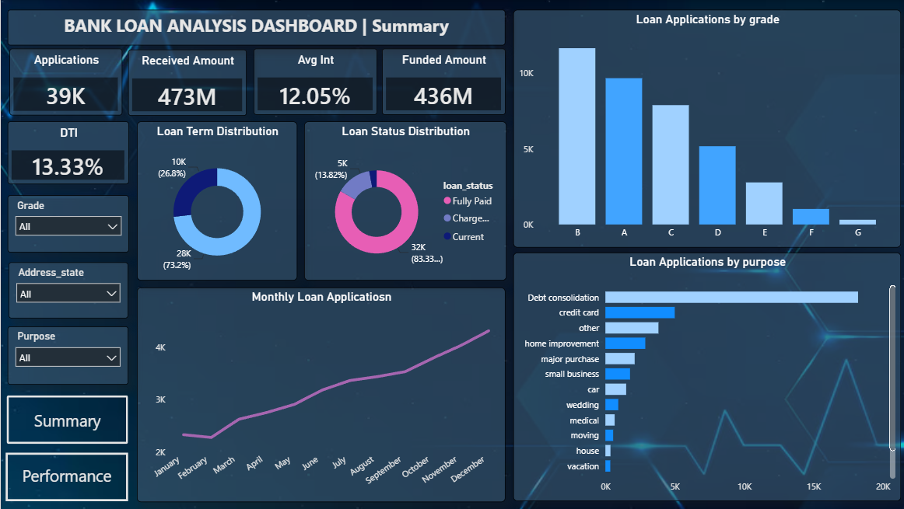
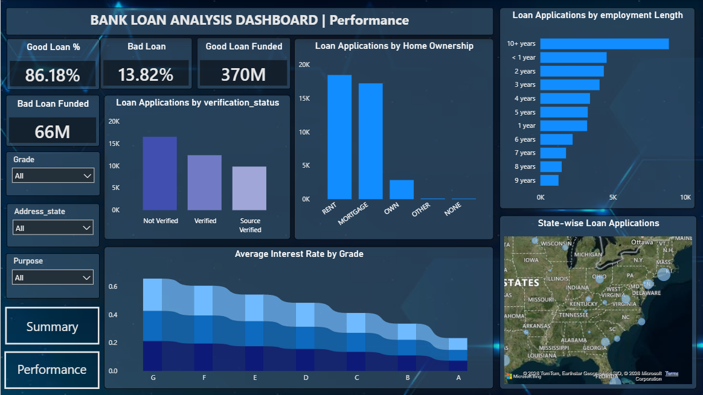

# 🏦 Bank Loan Analysis Dashboard

### Data Analyst Internship – Syntecxhub (Task 4)

An interactive **Bank Loan Analysis Dashboard** built using **Power BI** to analyze loan applications, funded amounts, repayment performance, and customer loan behavior. This project demonstrates data cleaning, DAX measure creation, KPI development, and interactive dashboard design for business decision-making.

---

# 📌 Project Overview

The objective of this project is to transform raw bank loan data into meaningful business insights through an interactive Power BI dashboard.

The dashboard enables users to:

- Analyze monthly loan application trends.
- Monitor funded and received loan amounts.
- Classify loans into Good Loans and Bad Loans.
- Analyze loan distribution by grade, purpose, and term.
- Study customer characteristics affecting loan performance.
- Explore the dashboard using interactive filters and navigation.

---

# 🛠️ Tools & Technologies

| Tool | Purpose |
|------|---------|
| Power BI Desktop | Dashboard Development |
| Power Query | Data Cleaning & Transformation |
| DAX | KPI Measures & Calculations |
| GitHub | Version Control & Project Hosting |

---

# 📂 Dataset

**Dataset:** Financial Loan Dataset

**File Format:** CSV

### Key Columns

- Loan ID
- Address State
- Loan Status
- Grade
- Purpose
- Home Ownership
- Employment Length
- Annual Income
- Loan Amount
- Total Payment
- Interest Rate
- Debt-to-Income Ratio (DTI)
- Loan Term
- Verification Status
- Issue Date

---

# 📊 Dashboard Pages

## 📄 Page 1 – Executive Summary

This page provides a high-level overview of the bank's loan portfolio.

### Features

- ✅ Total Loan Applications
- ✅ Total Funded Amount
- ✅ Total Amount Received
- ✅ Average Interest Rate
- ✅ Average DTI
- ✅ Monthly Loan Applications Trend
- ✅ Loan Status Distribution
- ✅ Loan Applications by Grade
- ✅ Loan Applications by Purpose
- ✅ Loan Term Distribution
- ✅ Interactive Filters (State, Grade, Purpose)

---

## 📄 Page 2 – Loan Performance Analysis

This page focuses on loan quality and customer-related analysis.

### Features

- ✅ Good Loan Percentage
- ✅ Bad Loan Percentage
- ✅ Good Loan Funded Amount
- ✅ Bad Loan Funded Amount
- ✅ Loan Applications by Home Ownership
- ✅ Loan Applications by Verification Status
- ✅ Loan Applications by Employment Length
- ✅ Average Interest Rate by Grade
- ✅ Loan Applications by State

---

# 📈 KPIs Created

- Total Loan Applications
- Total Funded Amount
- Total Amount Received
- Average Interest Rate
- Average DTI
- Good Loan Percentage
- Bad Loan Percentage
- Good Loan Funded Amount
- Bad Loan Funded Amount

---

# 📸 Dashboard Preview

## Executive Summary



---

## Loan Performance Analysis



---

# 💡 Key Insights

- Good Loans constitute the majority of the total loan portfolio.
- Debt Consolidation is one of the most common loan purposes.
- Grade A and Grade B have the highest number of loan applications.
- Most borrowers prefer a **36-month** loan term.
- Rent and Mortgage are the most common home ownership categories among borrowers.
- Loan performance varies across customer grades and verification status.

---

# 📁 Repository Structure

```text
Syntecxhub_Bank_Loan_Analysis/
│
├── Bank_Loan_Analysis.pbix
├── financial_loan.csv
├── page1.png
├── page2.png
└── README.md
```

---

# 👨‍💻 Author

**Diksha Bedkute**

B.E. – Artificial Intelligence and Data Science Engineering

DMCE College, Mumbai University

**GitHub:** https://github.com/Diksha1719

**LinkedIn:** https://www.linkedin.com/in/diksha-b-584643378

---

# ⭐ Task 4 Objectives Completed

✔ Imported and cleaned the bank loan dataset using Power Query.

✔ Created DAX measures to calculate banking KPIs.

✔ Classified loans into Good Loans and Bad Loans.

✔ Performed trend analysis using loan issue dates.

✔ Analyzed loan applications by grade, purpose, term, home ownership, employment length, and verification status.

✔ Built an interactive two-page Power BI dashboard with slicers and page navigation.

✔ Generated business insights to support loan portfolio analysis.

---

## 📌 Internship Information

**Internship:** Data Analyst Internship

**Organization:** Syntecxhub

**Task:** Task 4 – Bank Loan Analysis Dashboard

---

This project was developed as part of the **Syntecxhub Data Analyst Internship Program (Task 4)**.
